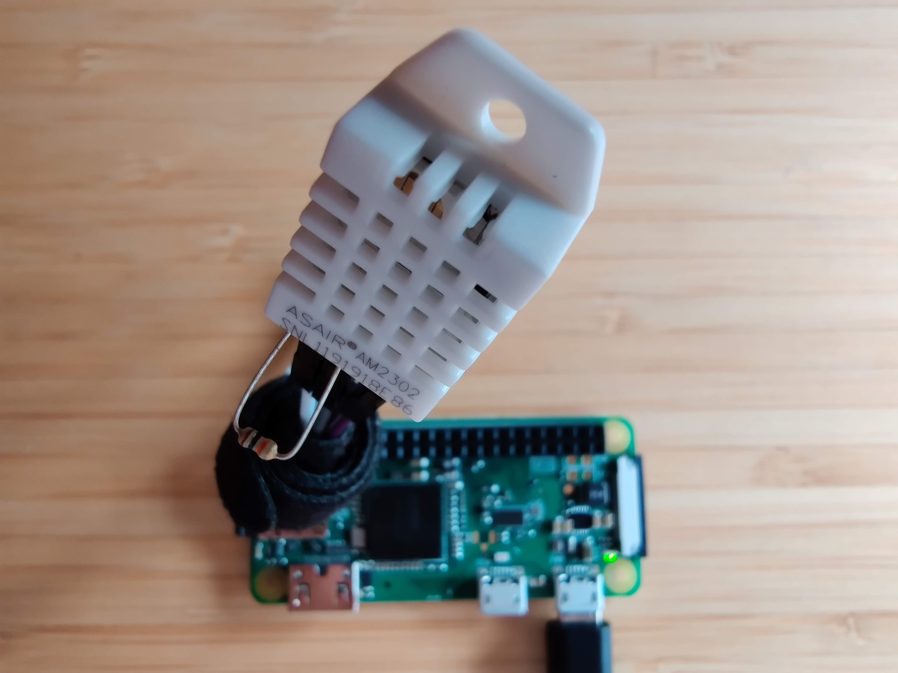
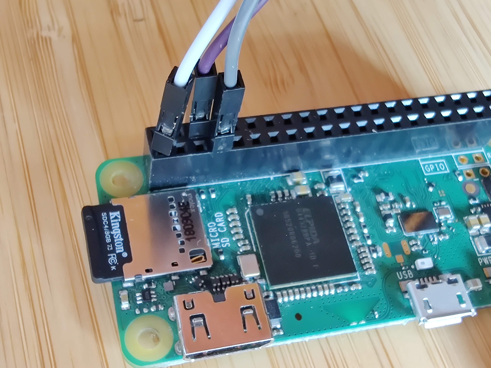
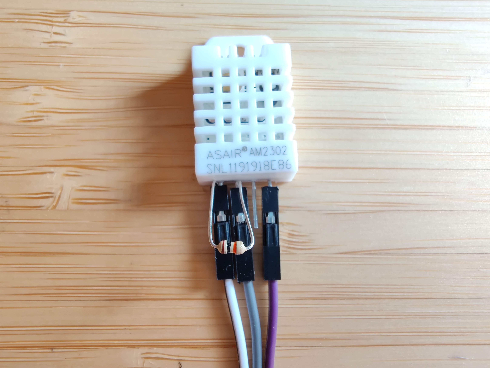
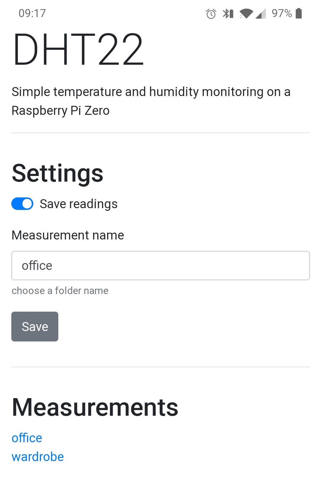
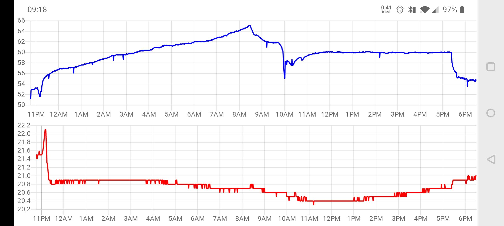

# Portable Humidity Logger
A battery powered Raspberry Pi Zero W using a DHT22 sensor to log regular humidity readings.

This repository accompanies a Medium article [here](https://medium.com/@tom.humph/monitoring-damp-with-a-raspberry-pi-zero-w-3b18b06c2e9)

## DHT22 sensor wiring

GPIO pins 1 (3V3 power), 7 (GPIO 4), 6 (Ground)

10k ohm resistor

## Interface

Changing the "measurement name" changes the directory that the data is saved to.

Viewing the data in the files.